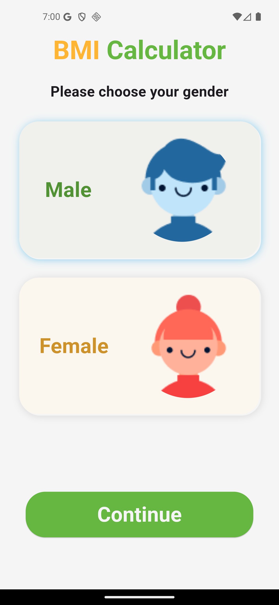
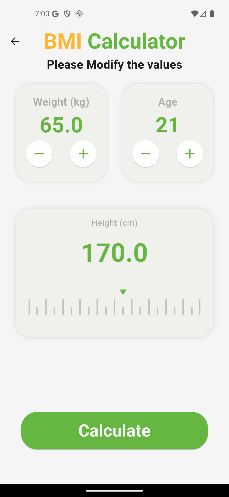
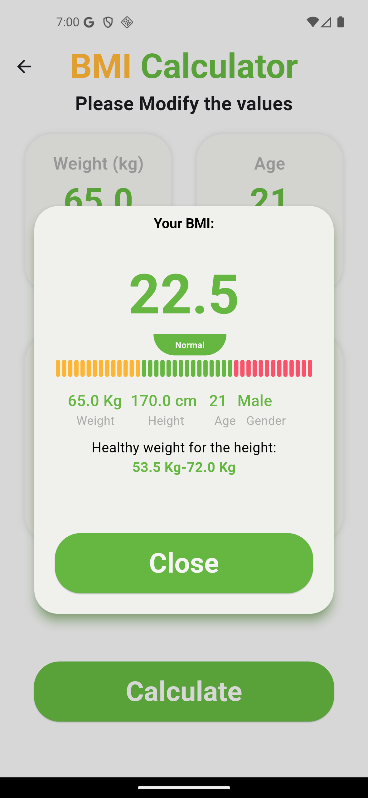

## BMI App

  

A clean,  Flutter application to calculate Body Mass Index (BMI) with a simple, guided flow and real-time results. Built with Provider for state management and designed to work across Android, iOS, and Web.

## Features

- **Guided flow**: Select gender, set height, weight, and age.

- **Live calculation**: BMI and classification update in real-time.

- **Clean UI**: Modular widgets with consistent theming.

- **State management**: Uses Provider for predictable state updates.

  
## Screens
- `GenderScreen`
-
- `MainScreen` (entry to flow)![[Screenshot_1757347205.png]]

- Result section (`ResultBar`) embedded in the main flow

